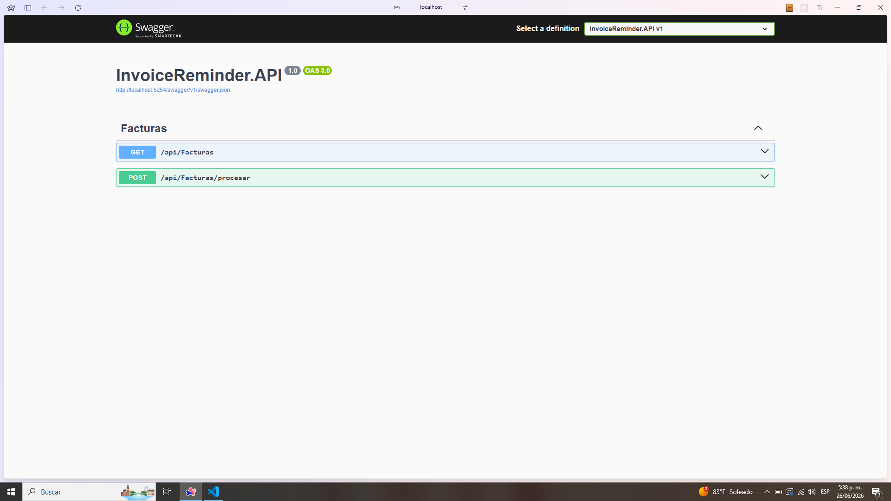

# Invoice Reminder API

Backend desarrollado en **ASP.NET Core 8 Web API** para la gestión automatizada de recordatorios de facturas utilizando **MongoDB Atlas**.

---

# Descripción

La API permite:

- Consultar facturas almacenadas en MongoDB.
- Identificar facturas con estado `primerrecordatorio` o `segundorecordatorio`.
- Enviar notificaciones por correo electrónico.
- Actualizar automáticamente el estado de las facturas.
- Exponer endpoints REST para consumo desde el frontend.

---

# Tecnologías utilizadas

- .NET 8
- ASP.NET Core Web API
- MongoDB Atlas
- MongoDB.Driver
- Swagger/OpenAPI
- xUnit
- Moq
- FluentAssertions

---

# Arquitectura

La aplicación implementa una arquitectura en capas basada en los principios SOLID y el patrón Repository.

```text
Controllers
     ↓
Services
     ↓
Repositories
     ↓
MongoDB Atlas
```

---

# Estructura del proyecto

```text
InvoiceReminder.API/

├── Configurations/
│   └── MongoDbSettings.cs
│
├── Controllers/
│   └── FacturasController.cs

├── Interfaces/
│   ├── IFacturaRepository.cs
│   ├── IFacturaService.cs
│   └── IEmailService.cs
│
├── Models/
│   └── Factura.cs
│
├── Repositories/
│   └── FacturaRepository.cs
│
├── Services/
│   ├── FacturaService.cs
│   └── EmailService.cs
│
├── Program.cs
└── appsettings.json
```

---

# Modelo de datos

Colección MongoDB:

```text
Facturas
```

Documento:

```json
{
    "_id": "ObjectId",
    "cliente": "Juan Pérez",
    "email": "juan@gmail.com",
    "numeroFactura": "FAC001",
    "valor": 350000,
    "estado": "primerrecordatorio"
}
```

---

# Reglas de negocio

El sistema procesa dos estados:

## Primer recordatorio

```text
primerrecordatorio
        ↓
Enviar correo
        ↓
segundorecordatorio
```

---

## Segundo recordatorio

```text
segundorecordatorio
        ↓
Enviar correo
        ↓
desactivado
```

---

# Principios SOLID implementados

## Single Responsibility Principle

Cada clase posee una única responsabilidad:

- `FacturaRepository`: acceso a datos.
- `FacturaService`: lógica de negocio.
- `EmailService`: envío de correos.

---

## Open/Closed Principle

La lógica puede extenderse para nuevos tipos de recordatorios sin modificar el comportamiento existente.

---

## Liskov Substitution Principle

Las implementaciones concretas pueden sustituir sus interfaces sin afectar el sistema.

---

## Interface Segregation Principle

Las interfaces fueron separadas por responsabilidad:

```text
IFacturaRepository
IFacturaService
IEmailService
```

---

## Dependency Inversion Principle

Las dependencias son inyectadas mediante el contenedor de ASP.NET Core.

```csharp
builder.Services.AddScoped<IFacturaRepository, FacturaRepository>();
builder.Services.AddScoped<IFacturaService, FacturaService>();
builder.Services.AddScoped<IEmailService, EmailService>();
```

---

# Patrón Repository

Se implementó el patrón Repository para desacoplar el acceso a MongoDB de la lógica de negocio.

```text
Controller
     ↓
Service
     ↓
Repository
     ↓
MongoDB
```

Beneficios:

- Separación de responsabilidades.
- Bajo acoplamiento.
- Mayor mantenibilidad.
- Facilita pruebas unitarias.

---

# Configuración de MongoDB

La conexión se realiza mediante MongoDB Atlas.

Las credenciales sensibles se almacenan utilizando User Secrets.

Inicializar User Secrets:

```bash
dotnet user-secrets init
```

Agregar cadena de conexión:

```bash
dotnet user-secrets set "MongoDb:ConnectionString" "mongodb+srv://..."
```

Configuración:

```json
{
  "MongoDb": {
    "DatabaseName": "InvoiceReminderDB",
    "CollectionName": "Facturas"
  }
}
```

---

# Ejecutar el proyecto

Restaurar dependencias:

```bash
dotnet restore
```

Ejecutar la API:

```bash
dotnet run
```

La API quedará disponible en:

```text
http://localhost:5254
```

Swagger:

```text
http://localhost:5254/swagger
```

---

# Endpoints

## Obtener todas las facturas

```http
GET /api/facturas
```

Respuesta:

```json
[
  {
    "cliente": "Juan Pérez",
    "email": "juan@gmail.com",
    "numeroFactura": "FAC001",
    "valor": 350000,
    "estado": "primerrecordatorio"
  }
]
```

---

## Procesar recordatorios

```http
POST /api/facturas/procesar
```

Proceso:

- Consulta facturas.
- Identifica estados.
- Envía correos.
- Actualiza estados.
- Persiste cambios.

---

# Pruebas unitarias

Se implementaron pruebas utilizando:

- xUnit
- Moq
- FluentAssertions

Casos cubiertos:

- Cambio de `primerrecordatorio` a `segundorecordatorio`.
- Cambio de `segundorecordatorio` a `desactivado`.
- Verificación del envío de correos.

Ejecutar pruebas:

```bash
dotnet test
```

Resultado actual:

```text
Correctas: 3
Errores: 0
Total: 3
```

---

# Autor

Javier Alejandro Zapata Ramos