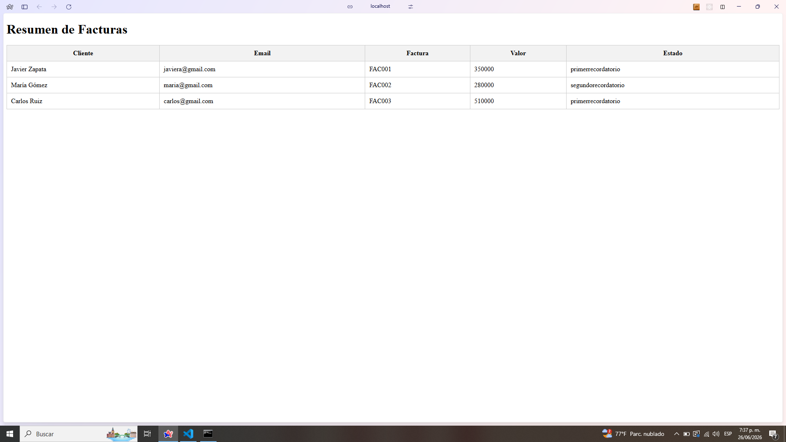

# Invoice Reminder UI

Frontend desarrollado en Angular 20 para la visualización de facturas y estados de recordatorio del sistema Invoice Reminder.

## Descripción

Esta aplicación permite visualizar las facturas almacenadas en MongoDB a través de una API REST desarrollada en ASP.NET Core 8. La interfaz presenta un resumen de los clientes, sus facturas y el estado actual del proceso de recordatorio.

El proyecto fue desarrollado como parte de una prueba técnica, implementando una arquitectura desacoplada entre frontend y backend.

---

## Tecnologías utilizadas

- Angular 20
- TypeScript
- HTML5
- CSS3
- RxJS
- Angular HttpClient

---

## Estructura del proyecto

```
src/
 └── app/
      ├── models/
      │     └── factura.ts
      │
      ├── services/
      │     └── factura.service.ts
      │
      └── pages/
            └── dashboard/
                  ├── dashboard.component.ts
                  ├── dashboard.component.html
                  └── dashboard.component.css
```

### Models

Contienen las interfaces utilizadas por la aplicación.

### Services

Contienen la lógica de comunicación con el backend mediante HTTP.

### Pages

Contienen los componentes visuales de la aplicación.

---

## Instalación

### 1. Clonar el repositorio

```bash
git clone <repositorio>
```

### 2. Ingresar al frontend

```bash
cd frontend/invoice-reminder-ui
```

### 3. Instalar dependencias

```bash
npm install
```

---

## Ejecución

Ejecutar el servidor de desarrollo:

```bash
ng serve
```

La aplicación estará disponible en:

```
http://localhost:4200
```

---

## Configuración del backend

El frontend consume la API REST desarrollada en ASP.NET Core.

Por defecto se conecta a:

```typescript
http://localhost:5254/api/facturas
```

Es necesario que el backend se encuentre ejecutándose previamente.

---

## Funcionalidades implementadas

- Consulta de facturas mediante API REST.
- Visualización de listado de facturas.
- Presentación de:
  - Cliente.
  - Correo electrónico.
  - Número de factura.
  - Valor.
  - Estado actual.
- Actualización automática de datos al consultar el backend.


---

## Arquitectura utilizada

El frontend implementa una arquitectura basada en separación de responsabilidades:

- **Models:** definición de entidades.
- **Services:** acceso a datos.
- **Components:** lógica de presentación.
- **Templates:** interfaz gráfica.

Esta estructura facilita el mantenimiento, escalabilidad y reutilización del código.

---

## Dependencias principales

```json
{
  "@angular/core": "^20",
  "@angular/common": "^20",
  "@angular/router": "^20",
  "rxjs": "^7"
}
```

---

## Autor

Desarrollado por:

**Javier Alejandro Zapata Ramos**

Prueba técnica desarrollada con:

- Angular
- ASP.NET Core 8
- MongoDB Atlas
- Arquitectura SOLID
- Inyección de dependencias
- Unit Testing